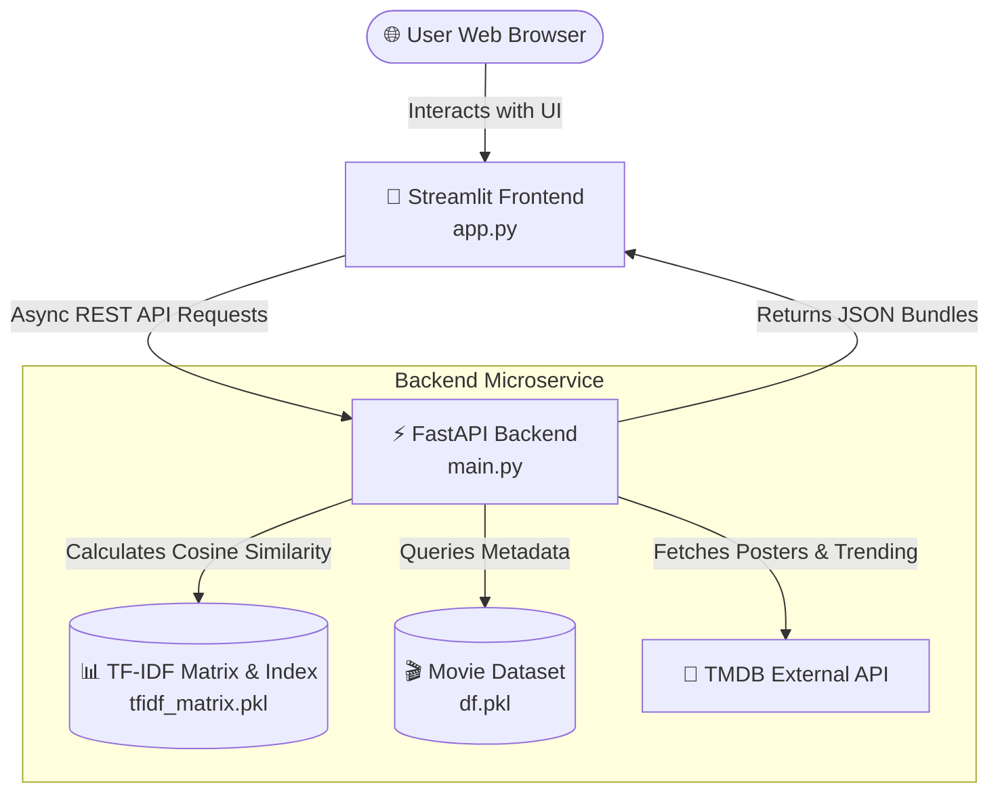

# 🎬 Movie Recommendation System

[](https://movie-recommendation-b8ft75kcpjlwwc3uhh2cxi.streamlit.app/)
[](https://movie-rec-api-v5yo.onrender.com/docs)
[](https://www.python.org/)
[](https://render.com)
[](https://scikit-learn.org/)

A full-stack, machine-learning-powered **Movie Recommendation Application**. Built with a **FastAPI** backend powering TF-IDF content-based filtering and **TMDB API** integration, paired with an interactive, modern **Streamlit** frontend interface.

🌐 **Live Web Application:** [movie-recommendation.streamlit.app](https://movie-recommendation-b8ft75kcpjlwwc3uhh2cxi.streamlit.app/)  
📖 **Interactive API Documentation (Swagger):** [movie-rec-api-v5yo.onrender.com/docs](https://movie-rec-api-v5yo.onrender.com/docs)

---

## 📌 Table of Contents
- [Features](#-features)
- [System Architecture](#-system-architecture)
- [Tech Stack](#-tech-stack)
- [Dataset & ML Methodology](#-dataset--ml-methodology)
- [API Endpoints](#-api-endpoints)
- [Local Installation & Setup](#-local-installation--setup)
- [Environment Variables](#-environment-variables)
- [Cloud Deployment](#-cloud-deployment)
- [Performance & Memory Optimizations](#-performance--memory-optimizations)
- [Author](#-author)

---

## ✨ Features

- **🤖 Content-Based Machine Learning Recommendations:** Uses TF-IDF vectorization and Cosine Similarity to recommend movies based on plot summaries, genres, and metadata across a dataset of over 45,000 movies.
- **🍿 Live TMDB Integration:** Fetches high-resolution movie posters, backdrop imagery, genres, release dates, ratings, and overviews in real time.
- **🔥 Dynamic Home Feed:** Explore trending, popular, top-rated, upcoming, and now-playing movies.
- **🎯 Hybrid Recommendation Engine:** Combines TF-IDF textual similarity with TMDB genre-based discovery for rich recommendation suggestions.
- **⚡ Memory-Optimized Microservice:** Built to run efficiently within tight cloud resource limits (sub-200 MB RAM memory footprint).
- **🎨 Responsive UI:** Clean card layout with single-page state routing and interactive movie detail views.

---

## 🏗 System Architecture



---

## 🛠 Tech Stack

### **Frontend**
- **[Streamlit](https://streamlit.io/):** Interactive web application UI framework with single-page session state navigation.
- **CSS3:** Custom styling for movie cards, grid layouts, and typography.

### **Backend**
- **[FastAPI](https://fastapi.tiangolo.com/):** High-performance asynchronous Python REST API framework.
- **[Uvicorn](https://www.uvicorn.org/):** Lightning-fast ASGI web server implementation.
- **[HTTPX](https://www.python-httpx.org/):** Asynchronous HTTP client for TMDB API communication.
- **[Pydantic](https://docs.pydantic.dev/):** Data validation and setting management.

### **Machine Learning & Data Science**
- **[Scikit-Learn](https://scikit-learn.org/):** TF-IDF Vectorization & Cosine Similarity.
- **[Pandas](https://pandas.pydata.org/) & [NumPy](https://numpy.org/):** Data processing, indexing, and linear algebra computations.
- **[SciPy](https://scipy.org/):** Sparse matrix representations for memory efficiency.

---

## 📊 Dataset & ML Methodology

1. **Data Preprocessing:** Cleaned metadata from over 45,000 movies (`movies_metadata.csv`), combining titles, overviews, genres, and taglines.
2. **TF-IDF Vectorization:** Transformed text features into a high-dimensional sparse TF-IDF feature matrix (`tfidf_matrix.pkl`).
3. **Similarity Computation:** Cosine similarity is computed between the target movie vector $\mathbf{v}_A$ and dataset vectors $\mathbf{v}_B$:

$$\text{Cosine Similarity}(A, B) = \frac{\mathbf{v}_A \cdot \mathbf{v}_B}{\|\mathbf{v}_A\| \|\mathbf{v}_B\|}$$

4. **Recommendation Generation:** Ranks the top $N$ highest scoring movies while filtering out identical titles.

---

## 🔌 API Endpoints

The FastAPI backend exposes the following REST API endpoints:

| Method | Endpoint | Description |
| :--- | :--- | :--- |
| `GET` | `/health` | Health check endpoint returning server status. |
| `GET` | `/home` | Retrieves home feed cards by category (`popular`, `trending`, `top_rated`, `upcoming`, `now_playing`). |
| `GET` | `/tmdb/search` | Performs real-time keyword search against TMDB API. |
| `GET` | `/movie/id/{tmdb_id}` | Retrieves full movie details, backdrop, overview, and genre list. |
| `GET` | `/recommend/tfidf` | Returns top $N$ TF-IDF content similarity recommendations for a given title. |
| `GET` | `/recommend/genre` | Returns popular movies matching the target movie's primary genre. |
| `GET` | `/movie/search` | Consolidated bundle endpoint returning movie details, TF-IDF recommendations, and genre matches in a single request. |

Full interactive API documentation is available at [/docs](https://movie-rec-api-v5yo.onrender.com/docs).

---

## 🚀 Local Installation & Setup

### Prerequisites
- Python `3.11.x`
- Git

### 1. Clone the Repository
```bash
git clone https://github.com/YuvrajManhas/Movie-Recommendation.git
cd Movie-Recommendation
```

### 2. Create and Activate Virtual Environment
```bash
# On Windows
python -m venv .venv
.venv\Scripts\activate

# On macOS/Linux
python3 -m venv .venv
source .venv/bin/activate
```

### 3. Install Dependencies
```bash
pip install -r requirements.txt
```

### 4. Set Environment Variables
Create a `.env` file in the root directory:
```ini
TMDB_API_KEY=your_tmdb_api_key_here
```

### 5. Run the Backend API
```bash
uvicorn main:app --reload --port 8000
```
*Backend will be running at `http://127.0.0.1:8000`.*

### 6. Run the Streamlit Frontend
In a new terminal tab:
```bash
streamlit run app.py
```
*Frontend will open automatically at `http://localhost:8501`.*

---

## 🔑 Environment Variables

| Variable | Description | Required |
| :--- | :--- | :---: |
| `TMDB_API_KEY` | TMDB API v3 key for fetching movie metadata and posters. | Yes |
| `API_BASE` | URL of the FastAPI backend service (defaults to deployed Render API). | No |

---

## ☁️ Cloud Deployment

- **Backend (FastAPI):** Deployed on **[Render](https://render.com)** as a Python 3.11 Web Service running Uvicorn.
- **Frontend (Streamlit):** Deployed on **[Streamlit Community Cloud](https://streamlit.io/cloud)** connected to the GitHub repository.

---

## ⚡ Performance & Memory Optimizations

To run smoothly on free-tier cloud environments (such as Render's 512 MB RAM limit):
- **Memory Unloading:** Extracts flat string titles into Python lists during startup rather than holding the entire heavy pandas DataFrame in RAM.
- **Garbage Collection:** Triggers explicit Python `gc.collect()` calls post-model initialization.
- **RAM Reduction:** Reduced memory footprint from **~550 MB $\rightarrow$ ~170 MB**, eliminating Out-Of-Memory (OOM) crashes.
- **Extended HTTP Timeout:** Configured Streamlit request handlers with a 60-second timeout window to gracefully accommodate Render cold-starts.

---

## 👨‍💻 Author

**Yuvraj Manhas**  
GitHub: [@YuvrajManhas](https://github.com/YuvrajManhas)
